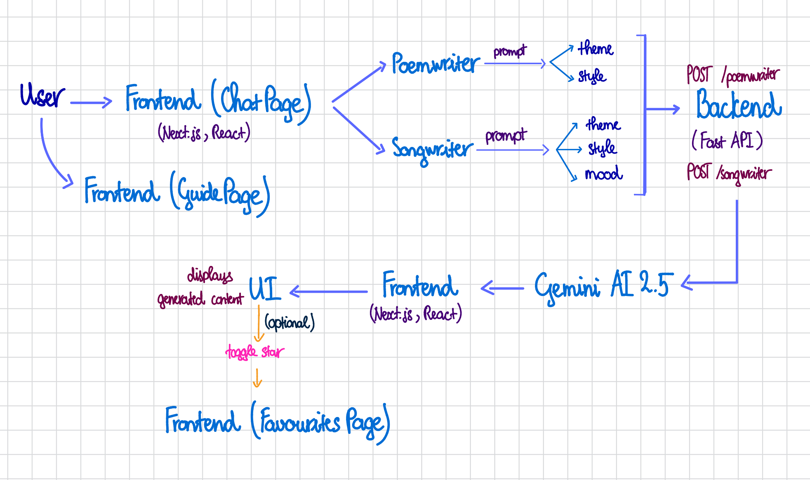

# Overview Report

## AI Songwriter & Poet
---
### A. Innovation

#### 1. Idea Overview
This project is a web application that allows users to generate **song lyrics** and **poetry** using a generative AI model (Gemini 2.5). Instead of requiring complex or full-sentence prompts, users provide **three simple inputs**:

- **Mood**: the emotion of the song or poem (e.g., happy, sad, nostalgic)  
- **Style**: the genre or artistic style (e.g., ballad, rap, free verse)  
- **Theme**: the topic or subject of the content (e.g., lost love, adventure)  

The AI then generates creative content tailored to these inputs, making it accessible for beginners, non-technical users, or anyone who wants quick inspiration.

#### 2. Innovation Analysis

- **Market Comparison**:  
  Current AI writing tools like ChatGPT, Jasper, or specialized lyric generators usually require **long prompts** or multiple instructions to get meaningful output. Users often need prior knowledge to get results they like.

- **Differentiation**:  
  This project focuses on **structured, keyword-style inputs**. Users only need to provide mood, style, and theme, simplifying the creative process while keeping output relevant and expressive.

- **User Experience Advantage**:  
  - Easy and quick for casual users.  
  - Dynamic, interactive interface with **real-time AI response**.  
  - Favorites system for saving generated content locally.

- **Category**: **Niche**  
  - Competitors exist, but the combination of **simple input format + intuitive UX + AI generation** is unique.  
  - Provides a small but valuable innovation in the generative AI content space.  

---

### B. Conception & Organization

#### 1. Task Breakdown

##### Backend
- Integrate Gemini API using the official SDK (`genai.Client`).  
- Create two main endpoints:
  - `POST /songwriter` → generate song lyrics based on user inputs.  
  - `POST /poemwriter` → generate poems based on user inputs.  
- Health check endpoint: `GET /health` → verify server is online.  
- Implement input validation, error handling, and UUID-based message tracking.

##### Frontend
- Main chat interface for songwriter and poet modes:
  - Input fields for Mood, Style, and Theme.  
  - Display AI-generated content dynamically.  
  - Show loading states while waiting for AI responses.  
- Guide page with:
  - Tips for songwriting and poetry.  
  - Best practices for using the AI effectively.  
- Favorites page:
  - Store user-selected content in `localStorage`.  
  - Display saved items and allow removing favorites.  
- Responsive UI for mobile and desktop devices.

##### Documentation
- **Reports**: project report combining innovation, architecture, AI integration, privacy, and security concerns.  
- **AI usage log (GenAI-log)**: tracks when and how generative AI was used, what inputs were given, and outputs received.  

#### 2. Architecture Diagram

#### 3. Project Management
- Tasks tracked using **GitHub Projects**:
  - Milestones: backend setup, frontend UI, AI integration, testing, documentation.  
- **Self-feedback**:
  - Regular evaluation of time management and task prioritization.  
  - Monitoring technical debt, identifying refactoring needs.  
  - Adjusting design decisions based on testing and usability feedback.

